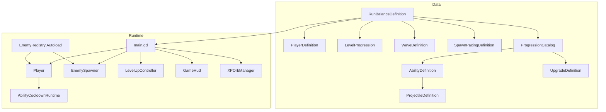
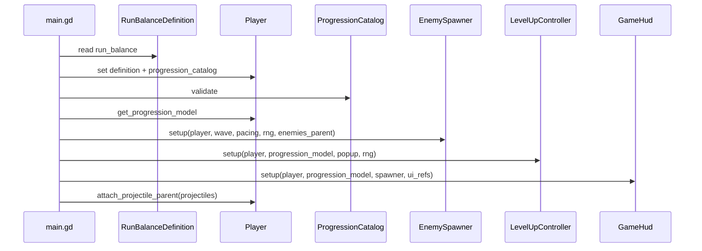
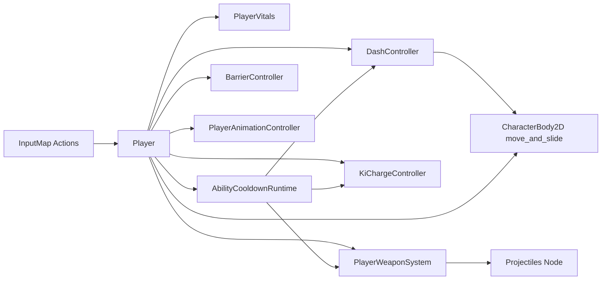
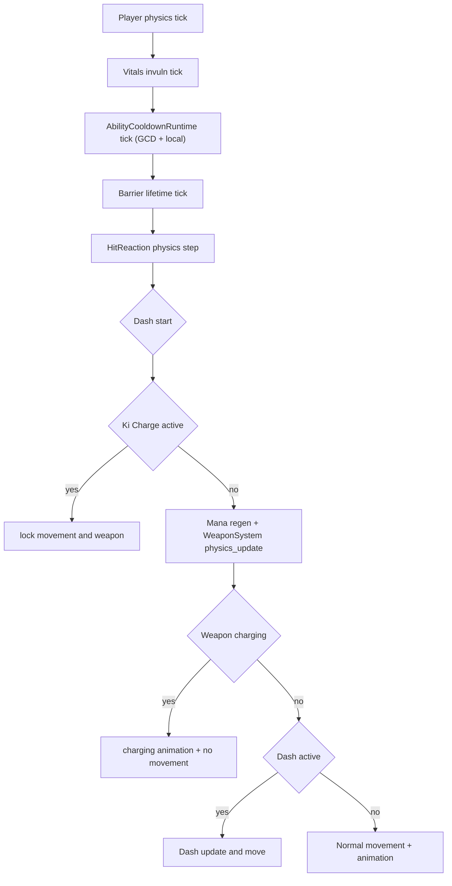
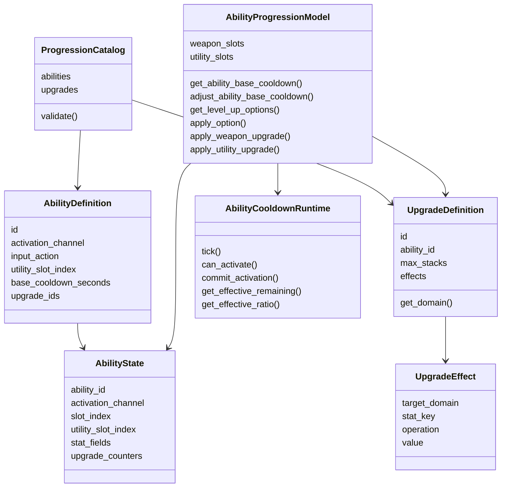
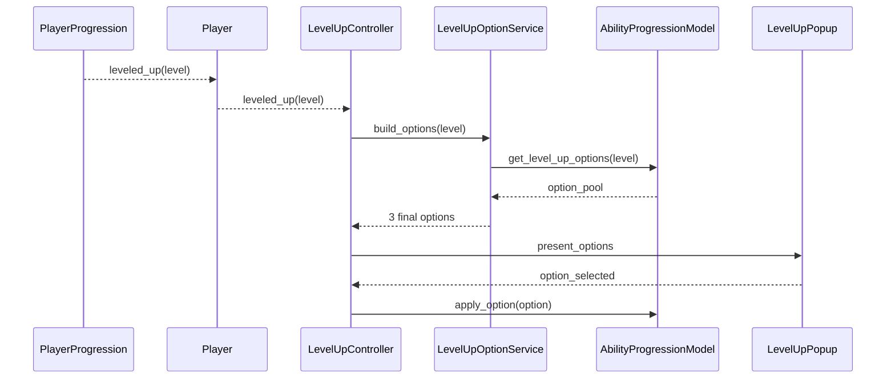
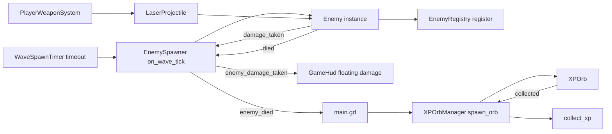
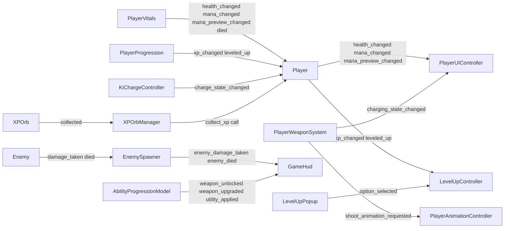
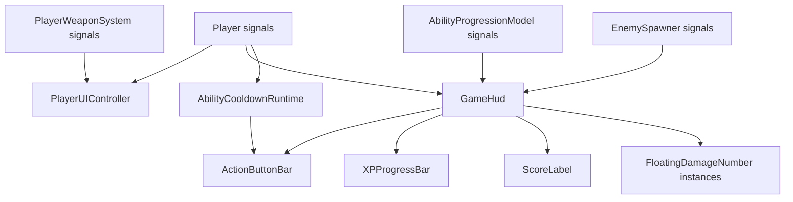

# Survivors Game Architekturuebersicht

Diese Datei beschreibt den **aktuellen Implementierungsstand** der Architektur. Fokus: Systemgrenzen, Datenfluss, Signalfluss, Runtime-Pipelines und Erweiterungspunkte.

## 1. Gesamtbild
Das Spiel wird zentral durch `main.gd` orchestriert. Balancing und Progression sind datengetrieben, Gameplay-Logik ist in spezialisierte Runtime-Systeme aufgeteilt.

## 2. Boot- und Setup-Flow
`main.gd` schreibt die Run-Daten bereits in `_enter_tree` in die Szenenknoten. Danach validiert `_ready` den Catalog erneut und startet Runtime-Systeme.

## 3. Szenen- und Komponentenstruktur
Der Player ist ein Orchestrator; Mechanik liegt in Komponenten.

- `PlayerVitals`: HP, Mana, Invuln, XP-Magnetradius.
- `AbilityCooldownRuntime`: Global Cooldown (GCD) + ability-spezifische Cooldowns.
- `DashController`: Dash-Status, Kollision/Phase, Afterimages; Cooldown-Gating ueber Runtime.
- `KiChargeController`: Charge-Status, Regen-Boost, Release-AOE/Knockback.
- `BarrierController`: Absorb/Lifetime/Reflect vor Vitals-Schaden.
- `PlayerWeaponSystem`: Weapon-Slot-Input, Charge-Flow, Projektilspawns.
- `PlayerAnimationController`: Animationszustandslogik.

## 4. Player Runtime-Pipeline
Die Player-Loop ist explizit sequenziell. Prioritaeten:
1) Death/Invuln/Hit-Reaction,
2) Dash + Ki-Charge Gate,
3) Weapon-Update,
4) Movement + Animation.

## 5. Ability- und Upgrade-Architektur
Abilities (Weapon + Utility) laufen im selben Model (`AbilityProgressionModel`) ueber `AbilityState`.

- Weapon-Channel: Slots `action1..3`, Unlocks im Run moeglich.
- Utility-Channel: feste Utility-Slots mit `input_action` und `utility_slot_index`.
- Basis-Cooldown ist datengetrieben pro Ability (`AbilityDefinition.base_cooldown_seconds`).
- Aktivierung ist einheitlich: `can_activate(ability_id)` vor Cast und `commit_activation(ability_id)` bei erfolgreicher Aktivierung.
- Upgrades sind ability-gebunden (`UpgradeDefinition.ability_id`).

## 6. Level-Up Pipeline
Optionen kommen zentral aus dem ProgressionModel; Auswahl und Pause-Handling liegen im Controller.

## 7. Combat- und Enemy-Flow
Enemies werden durch Timer-Ticks ueber `EnemySpawner` erzeugt. Projektile treffen `DamageableBody2D`-Subklassen (Enemy, Player).

## 8. Signalmatrix (Emitter -> Consumer)
Die wichtigsten Laufzeit-Signale und ihre Konsumenten:

| Emitter | Signal | Consumer | Zweck |
|---|---|---|---|
| `PlayerVitals` | `health_changed` | `Player` -> `PlayerUIController` | HP-UI aktualisieren |
| `PlayerVitals` | `mana_changed` | `Player` -> `PlayerUIController` | Mana-UI aktualisieren |
| `PlayerVitals` | `mana_preview_changed` | `Player` -> `PlayerUIController` | Charge-Mana-Preview |
| `PlayerVitals` | `died` | `Player` | Player-Tod propagieren |
| `PlayerProgression` | `xp_changed` | `Player` -> `GameHud` | XP-Bar + Leveltext |
| `PlayerProgression` | `leveled_up` | `Player` -> `LevelUpController` | Level-Up Queue |
| `PlayerWeaponSystem` | `shoot_animation_requested` | `PlayerAnimationController` | Shoot-Anim triggern |
| `PlayerWeaponSystem` | `charging_state_changed` | `PlayerUIController` | Mana-Preview on/off |
| `KiChargeController` | `charge_state_changed` | `Player` | Aura-Animation steuern |
| `Enemy` | `damage_taken` | `EnemySpawner` -> `GameHud` | Floating Damage Number |
| `Enemy` | `died` | `EnemySpawner` -> `main` + `GameHud` | XP-Orbs + Kills |
| `XPOrb` | `collected` | `XPOrbManager` -> `Player` | XP gutschreiben |
| `AbilityProgressionModel` | `weapon_unlocked` | `GameHud` | Weapon-Icons refresh |
| `AbilityProgressionModel` | `weapon_upgraded` | `GameHud` | Weapon-Icons refresh |
| `AbilityProgressionModel` | `utility_applied` | `GameHud` | Utility-Icons refresh |
| `LevelUpPopup` | `option_selected` | `LevelUpController` | Upgrade anwenden |

## 9. UI-Systeme
Zwei getrennte UI-Flows laufen parallel:

- `PlayerUIController`: Health/Mana/ManaPreview direkt am Player.
- `GameHud`: Kills, XP, PowerLevel, ActionButtonBar (inkl. Cooldown-Overlay), FloatingDamageNumbers.
- `ActionButtonBar`: Overlay-Fuellung laeuft pro Slot von oben nach unten und zeigt `AbilityCooldownRuntime.get_effective_ratio(ability_id)`.

## 10. Validierungs- und Fail-Fast-Regeln
Die wichtigste Integritaet wird vor Run-Start abgesichert:

- `RunBalanceDefinition.is_valid()` muss alle Referenzen enthalten.
- `ProgressionCatalog.validate()` prueft u. a.:
  - doppelte/ungueltige Ability- und Upgrade-IDs,
  - gueltige Ability-Icons,
  - Utility-Aktivierungsdaten (`input_action`, `utility_slot_index`, eindeutige Utility-Slots),
  - nicht-negative Ability-Cooldowns (`base_cooldown_seconds >= 0`),
  - Ability-Upgrade-Links inkl. Domain-Konsistenz,
  - ability-gebundene Utility-Upgrades.

Wenn Validierung fehlschlaegt, stoppt `main.gd` den Aufbau frueh.

## 11. Erweiterungspunkte
Die Architektur ist auf neue Inhalte ausgelegt:

- Neue Ability: `AbilityDefinition` + optional `ProjectileDefinition` + Catalog-Eintrag.
- Cooldown-Balancing: `base_cooldown_seconds` direkt in der Ability-Ressource.
- Neues Upgrade: `UpgradeDefinition.effects` + Catalog-Eintrag + `upgrade_ids` an Ability.
- Neues Utility-Statziel: neuer `stat_key` + Mapping in `UtilityUpgradeApplier`.
- Neue Enemy-Variante: `EnemyDefinition` + `WaveStage`-Eintrag.
- Neues Spawnverhalten: Kurven in `SpawnPacingDefinition`.

Die Orchestrierung bleibt dabei stabil, weil `main.gd`, `AbilityProgressionModel` und `EnemySpawner` als feste Integrationspunkte dienen.
