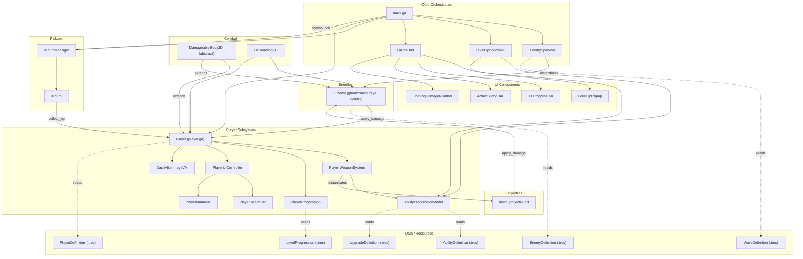
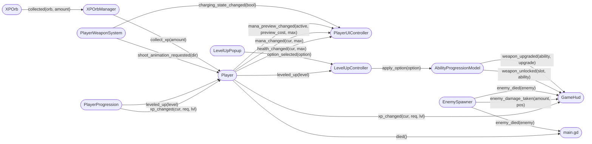
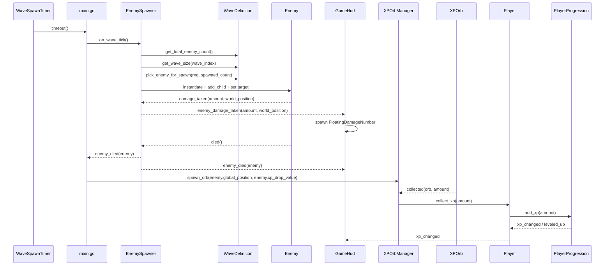
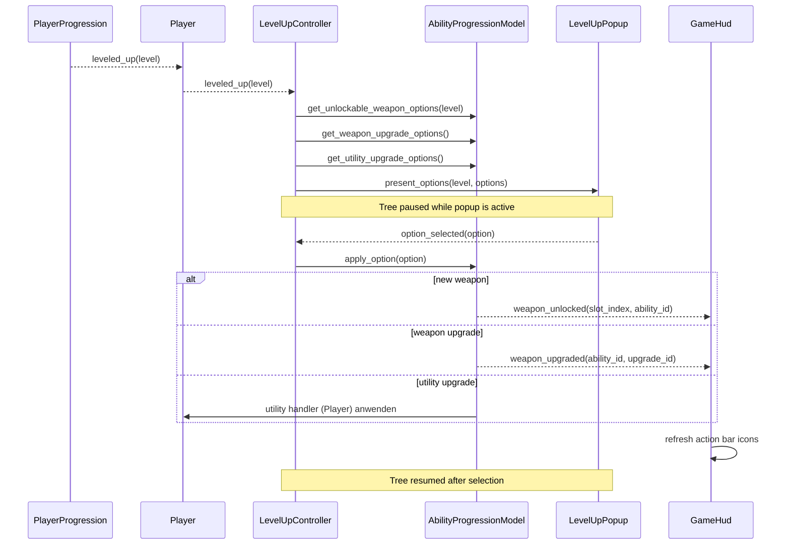
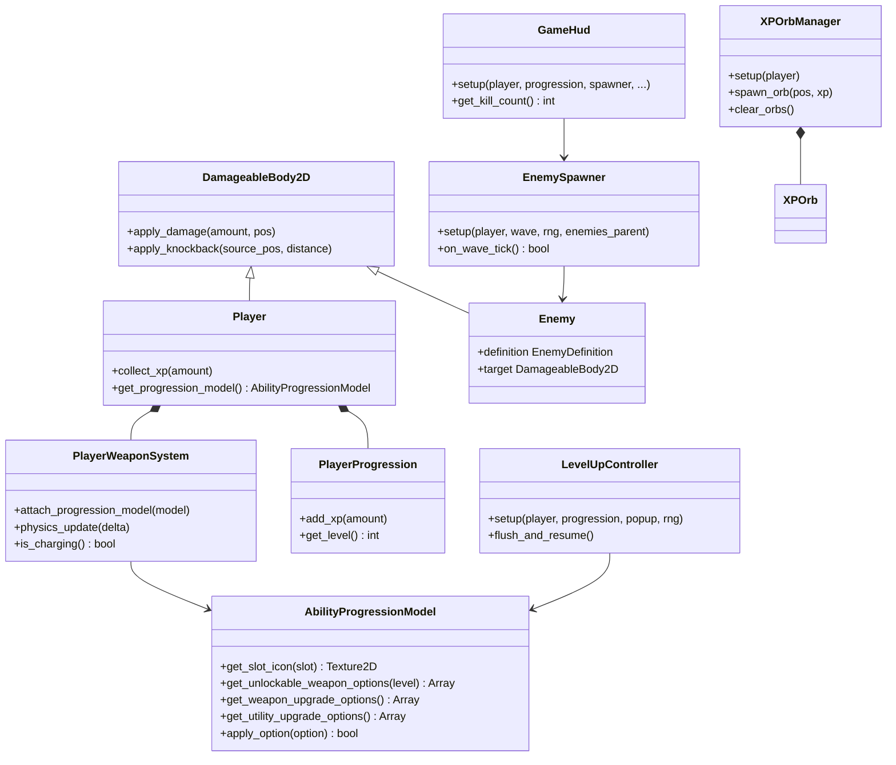

# Survivors Game – Architekturübersicht (Post-Refactor)

## 1. Systemübersicht



---

## 2. Signal-Verbindungen



---

## 3. Spawn-, Kampf- und XP-Datenfluss



---

## 4. Level-Up Datenfluss



---

## 5. Vererbungs- und Kompositionshierarchie



---

## 6. Ressourcen-Hierarchie

```text
res://resources/
├── balance/
│   ├── player_default.tres          -> PlayerDefinition (HP/Mana/Movement/Utility Upgrades)
│   ├── enemies/*.tres               -> EnemyDefinition (Combat/Movement/Rewards)
│   ├── waves/default_run.tres       -> WaveDefinition + WaveStage-Verteilung
│   └── level_progression_default.tres -> LevelProgression (XP-Kurve)
└── progression/
    ├── abilities/*.tres             -> AbilityDefinition (Weapon/Utility-Abilities)
    ├── upgrades/**/*.tres            -> UpgradeDefinition (Weapon + Utility)
    └── icons/*.tres                 -> Icon-Ressourcen
```

---

## 7. Schnellreferenz – Signaltabelle

| Signal | Emittiert von | Empfangen von | Effekt |
|---|---|---|---|
| `xp_changed(current, required, level)` | `PlayerProgression` | `Player` | Player spiegelt XP-Status nach außen |
| `leveled_up(new_level)` | `PlayerProgression` | `Player` | Player reicht Level-Up weiter |
| `health_changed(current, max)` | `Player` | `PlayerUIController` | HealthBar aktualisieren |
| `mana_changed(current, max)` | `Player` | `PlayerUIController` | ManaBar aktualisieren |
| `mana_preview_changed(active, preview_cost, max)` | `Player` | `PlayerUIController` | Mana-Vorschau aktualisieren |
| `xp_changed(current, required, level)` | `Player` | `GameHud` | XPProgressBar + Level-Label aktualisieren |
| `leveled_up(new_level)` | `Player` | `LevelUpController` | Level-Up Queue/Pause-Flow starten |
| `died()` | `Player` | `main.gd` | Spawn stoppen, Cleanup, Game Over anzeigen |
| `shoot_animation_requested(dir)` | `PlayerWeaponSystem` | `Player` | Schussanimation abspielen |
| `charging_state_changed(is_charging)` | `PlayerWeaponSystem` | `PlayerUIController` | ManaBar Charge-Preview anzeigen/verstecken |
| `enemy_damage_taken(amount, world_position)` | `EnemySpawner` | `GameHud` | FloatingDamageNumber erzeugen |
| `enemy_died(enemy)` | `EnemySpawner` | `GameHud`, `main.gd` | Kill-Counter + XP-Orb-Spawn |
| `option_selected(option)` | `LevelUpPopup` | `LevelUpController` | Option anwenden und Spiel fortsetzen |
| `weapon_unlocked(slot_index, ability_id)` | `AbilityProgressionModel` | `GameHud` | ActionBar-Icons aktualisieren |
| `weapon_upgraded(ability_id, upgrade_id)` | `AbilityProgressionModel` | `GameHud` | ActionBar-Icons aktualisieren |
| `utility_applied(upgrade_id)` | `AbilityProgressionModel` | *(aktuell kein Listener)* | Event für potenzielle zukünftige UI-Hooks |
| `collected(orb, amount)` | `XPOrb` | `XPOrbManager` | XP einsammeln + Orb recyceln |
