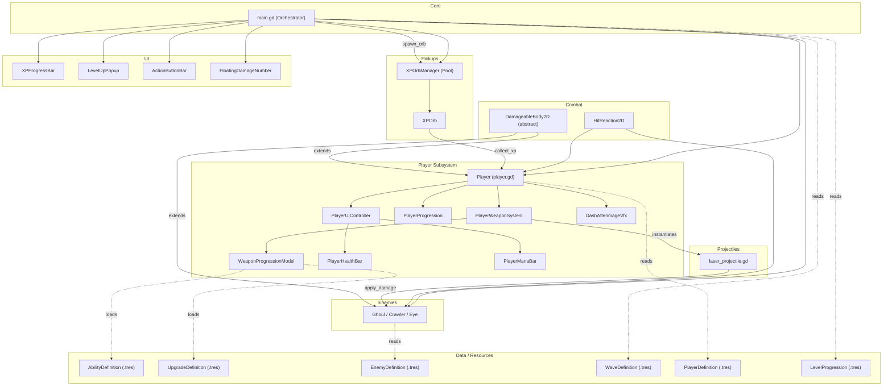
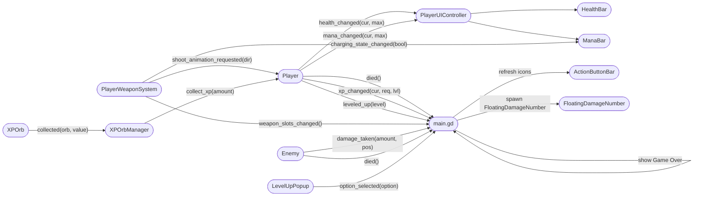
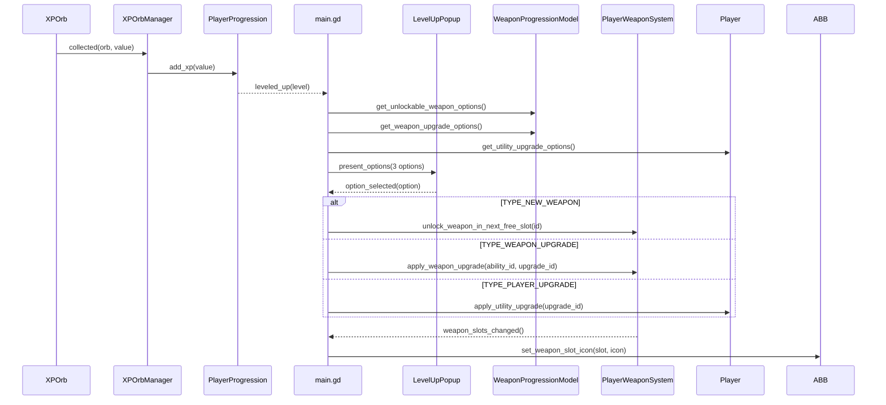
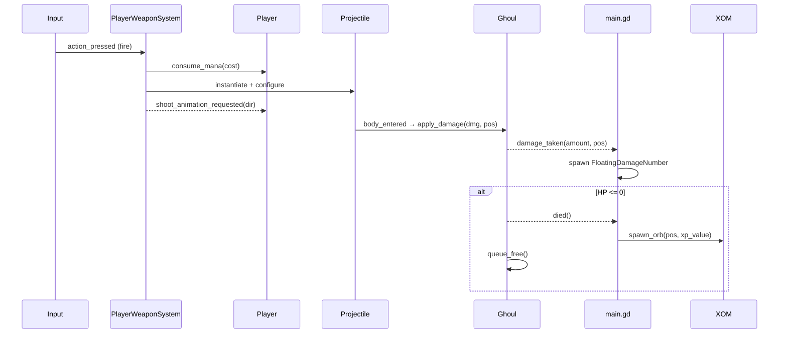
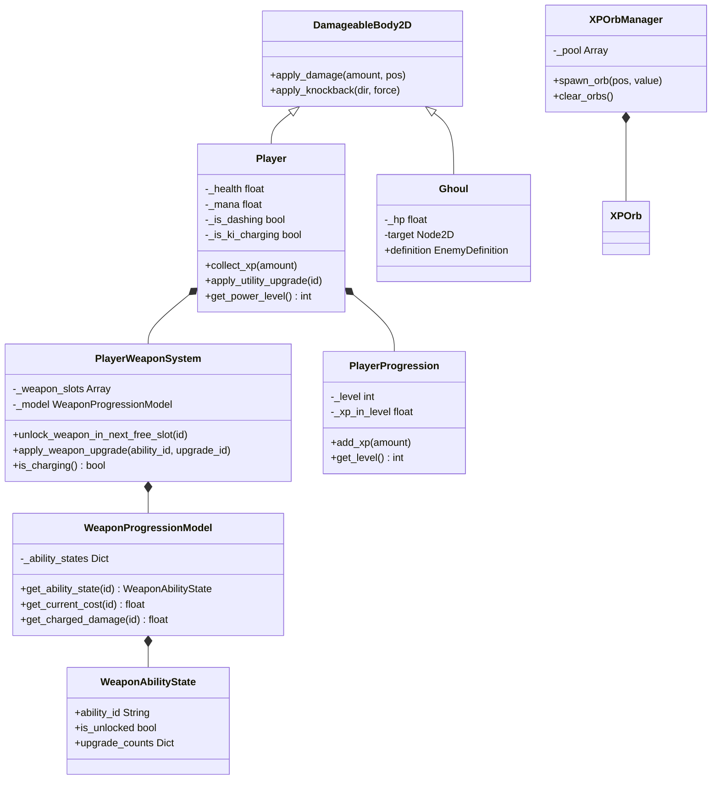

# Survivors Game – Architekturübersicht

## 1. Systemübersicht



---

## 2. Signal-Verbindungen



---

## 3. Level-Up Datenfluss



---

## 4. Kampf- & Schadensfluss



---

## 5. Vererbungs- & Kompositionshierarchie



---

## 6. Ressourcen-Hierarchie

```
res://resources/
├── balance/
│   ├── player/         → PlayerDefinition.tres   (HP, Mana, Dash-Stats)
│   ├── enemies/        → EnemyDefinition.tres     (HP, Damage, Speed)
│   ├── waves/          → WaveDefinition.tres      (Spawn-Regeln, Stages)
│   └── progression/    → LevelProgression.tres    (XP-Kurve)
└── progression/
    ├── abilities/      → AbilityDefinition.tres   (Damage, Cost, Pierce…)
    ├── upgrades/       → UpgradeDefinition.tres   (Wert, Max-Stacks)
    └── icons/          → Texture-Atlas .tres
```

---

## 7. Schnellreferenz – Signaltabelle

| Signal | Emittiert von | Empfangen von | Effekt |
|---|---|---|---|
| `health_changed(cur, max)` | Player | PlayerUIController | HealthBar aktualisieren |
| `mana_changed(cur, max)` | Player | PlayerUIController | ManaBar aktualisieren |
| `xp_changed(cur, req, lvl)` | PlayerProgression | main.gd | XPProgressBar + Label |
| `leveled_up(level)` | PlayerProgression | main.gd | Level-Up Popup öffnen |
| `died()` | Player | main.gd | Game Over zeigen |
| `weapon_slots_changed()` | PlayerWeaponSystem | main.gd | ActionButtonBar Icons refresh |
| `charging_state_changed(bool)` | PlayerWeaponSystem | PlayerUIController | ManaBar Vorschau |
| `shoot_animation_requested(dir)` | PlayerWeaponSystem | Player | Schussanimation abspielen |
| `damage_taken(amount, pos)` | Ghoul/Enemy | main.gd | FloatingDamageNumber spawnen |
| `died()` | Ghoul/Enemy | main.gd | XP Orb spawnen |
| `collected(orb, value)` | XPOrb | XPOrbManager | `player.collect_xp()` aufrufen |
| `option_selected(option)` | LevelUpPopup | main.gd | Upgrade anwenden |
